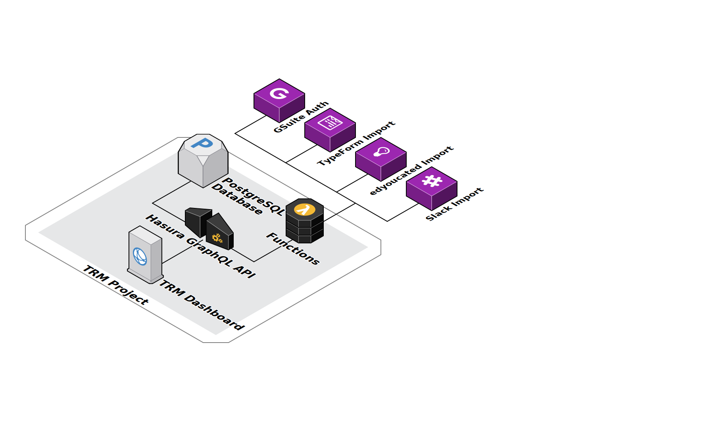

# Techie Relationship Management

The **Techie Relationship Management (TRM)** project at [TechLabs](https://techlabs.org) provides a data platform to store & analyze all information we have about our Techies (participants). We want to know **who they are** and **how they're doing** throughout their journey to become a Digital Shaper.

This project aims to provide a **standardized platform** across TechLabs locations. It **integrates** with existing tools within the TechLabs organization, such as TypeForm, GSuite, and Slack. The **TRM Dashboard** is a web application for the local journey teams to view, edit, and analyze the data for their Techies to get actionable insights for improving the TechLabs experience.

## Resources

- [Techie Relationship Management page on Notion](https://www.notion.so/techlabs/Techie-Relationship-Management-0b51be902d724043b756e1a32cca24c4) – used for scope & project planning, to-dos, and meeting notes
- [Slack Channel](https://techlabs-mgmt.slack.com/archives/C017RB4P0PL) on the TechLabs MGMT Slack workspace

## Architecture



As for the main components, we have Hasura, the TRM Dashboard, and some [serverless functions](https://www.twilio.com/docs/glossary/what-is-serverless-architecture) for integrating external providers.

- The [Hasura GraphQL engine](https://hasura.io/) provides a GraphQL API used by the TRM dashboard and provider integrations.
- The TRM Dashboard is a React single-page web application (SPA) based on the [_react-admin_](https://marmelab.com/react-admin/) framework. See [`/frontend/`](frontend/) for the dashboard source code.
- The serverless functions in [`/functions/`](/functions/) integrate the TRM project with external providers, such as for authentification with Google, retrieving form responses from TypeForm, and fetching activity data from edyoucated & Slack.
- PostgreSQL is used for data storage & retrieval

## Development

### Requirements

- Docker (Desktop) – [Docker for Mac](https://docs.docker.com/docker-for-mac/install/) / [Docker for Windows](https://docs.docker.com/docker-for-windows/install/)
- [NodeJS](https://nodejs.org/en/) v13.9.0 or higher
- [Yarn](https://yarnpkg.com/) v1.22.4 or higher

### Setup

1. Check out repository
2. (Dashboard only) Install npm packages:
   1. `cd frontend`
   2. `yarn install`
3. Run `docker-compose up`

### Usage

- Run `docker-compose exec hasura hasura-cli console --address 0.0.0.0 --no-browser` and open [http://localhost:9695](http://localhost:9695) for the Hasura console.

- Run the Dashboard development server:

  - Copy `src/config.example.js` to `src/config.js`

  - For local development, set these values:

    ```
    export default {
      graphqlApiURL: 'http://localhost:8080/v1/graphql'
    }
    ```

  - Run `yarn start`

## Deployment

The project is deployed on [Google Cloud Platform (GCP)](https://cloud.google.com/). Follow the [guide for setting up GCP](/docs/google-cloud-setup.md).

The infrastructure (see [`/infrastructure/`](/infrastructure/)) is managed with [Terraform](https://www.terraform.io/) in two projects:

- [`/infrastructure/common`](/infrastructure/common) for all shared resources between environments: the Cloud SQL PostgreSQL database and a Google Artifact Registry Repository
- [`/infrastructure/app`](/infrastructure/app) provides resources for a specific environment: the Hasura instance as a [Cloud Run](https://cloud.google.com/run) service, and the serverless functions in [Cloud Functions](https://cloud.google.com/functions)

The deployment process runs the [GitHub Actions](https://github.com/features/actions) [`deploy` workflow](/.github/workflows/deploy.yml)  for every push to the deployment branches:

- `staging` branch for the _staging_ environment
- `production` branch for the _production_ environment

The TRM Dashbaord is deployed on [GitHub pages](https://pages.github.com/). GitHub Actions builds the frontend and commits the build in the following repositories:

- [`TechLabs-Berlin/trm-frontend-staging`](github.com/TechLabs-Berlin/trm-frontend-staging) – for the _staging_ environment
- [`TechLabs-Berlin/trm-frontend-production`](github.com/TechLabs-Berlin/trm-frontend-production) – for the _production_ environment

## Contributing

We appreciate any contribution and are happy to get in touch. If you see a problem, please [open an issue](https://github.com/TechLabs-Berlin/trm/issues/new) in this repository. For write access to this repository, please send a message on our [Slack Channel](https://techlabs-mgmt.slack.com/archives/C017RB4P0PL)

To contribute code, we use a Pull Request workflow:

1. Create a branch with your proposed changes and [open a Pull Request](https://github.com/TechLabs-Berlin/trm/compare)
2. We work with you for review and merge your code into the `main` branch.

## License

The `TechLabs-Berlin/trm` project is [licensed MIT](LICENSE.txt). Learn more about MIT license on [_choosealicense.com_](https://choosealicense.com/licenses/mit/).

